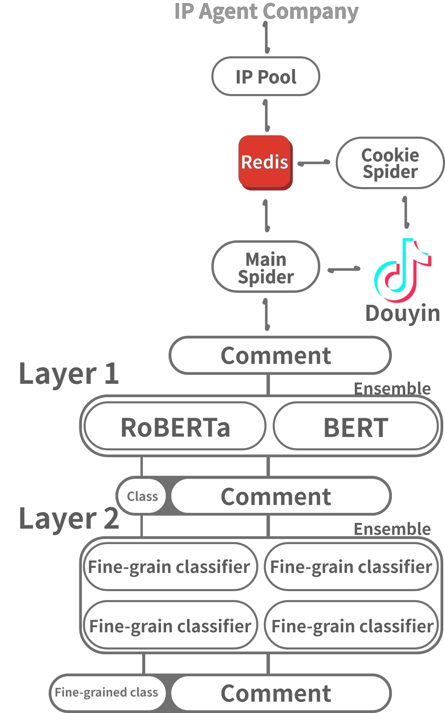

# Big Data Empirical Study on the Optimization Path of Rural Short Video Value Guidance Effect

::: info
Accepted by *Journalism lover* **（CSSCI）**, Expected to be released in the 10th issue.
:::

**Author:** Wenwen, Zhang.,Yiyu, Liu., **Yulin, Zhou.**

**Abstract:** In the digital age, short videos have become a new impetus for guiding public opinion and shaping emotional values by virtue of their own communication advantages. The value guidance and emotion mobilization effect of short videos can make socialist core values enter into the ears, minds and hearts. Using fine-grained sentiment analysis and content analysis to quantify the emotional mobilization effect of rural short videos in terms of value guidance, we explore the discourse mode that affects the value guidance effect of short videos, and put forward the innovative development path of rural short videos of "combining the two points, linking the three sides, and creating the four dimensions", which is a new approach to enhance the value guidance and emotional mobilization effect of short videos, and provide a new impetus for the value guidance and emotional mobilization of short videos. We propose the innovative development path of "two-point combination, three-plane linkage and four-dimensional co-creation" for the purpose of enhancing the value guidance and emotion mobilization of short videos, and helping and empowering the rural cultural revitalization.

**Key words:** Rural short video;value guidance:mobilization effect:fine-grained sentiment analysis.

## My contribution
### Spider :file_folder: [Repo address](https://github.com/Bluedyson/Aiohttp_Spider)

**IP connection pool:**  Primarily utilized to maintain the availability of proxy IPs. Given the finite quantity of IPs provided within a specific timeframe by proxy vendors, and the inherent time limits associated with the use of IPs, the objective is to supply as many valid IPs as possible to the Cookie Scheduler and the main crawler.

**Cookie Spider:** Due to access frequency limitations and Cookie verification on Douyin, the Cookie Scheduler periodically acquires proxy IPs to provide high-speed crawling capabilities to the main crawler.

**Main Crawler:** This comprises three components: the address producer, address consumer, and text storage. The first component reads the crawl records from the Redis database to generate crawl addresses. The second component is an asynchronous crawler that significantly enhances crawling efficiency by sending multiple requests using multiple proxy IPs due to the limited network return rate. The third component adopts asynchronous storage to reduce the impact of file operation IO blocking on overall operational efficiency.

    

        
        
1. Data Processing Architecture

    

### Fine-Grained Classifier :file_folder: [Repo address](https://github.com/Bluedyson/Fine_grained_classification)

**Model Architecture:** Utilizing stacking approach, the first-layer model conducts coarse-grained classification. During the sentiment task training, this model incorporates other comment sentiment training texts, with the final output resulting from a mixed multi-model voting process. The second-layer model performs secondary refinement based on the combined results of the first-layer model's classification to derive the ultimate outcome.

**RESULT:** The self-constructed dataset achieved an accuracy rate of **81.6%** in fine-grained sentiment classification and a value-oriented topic classification accuracy rate of **78.2%.**