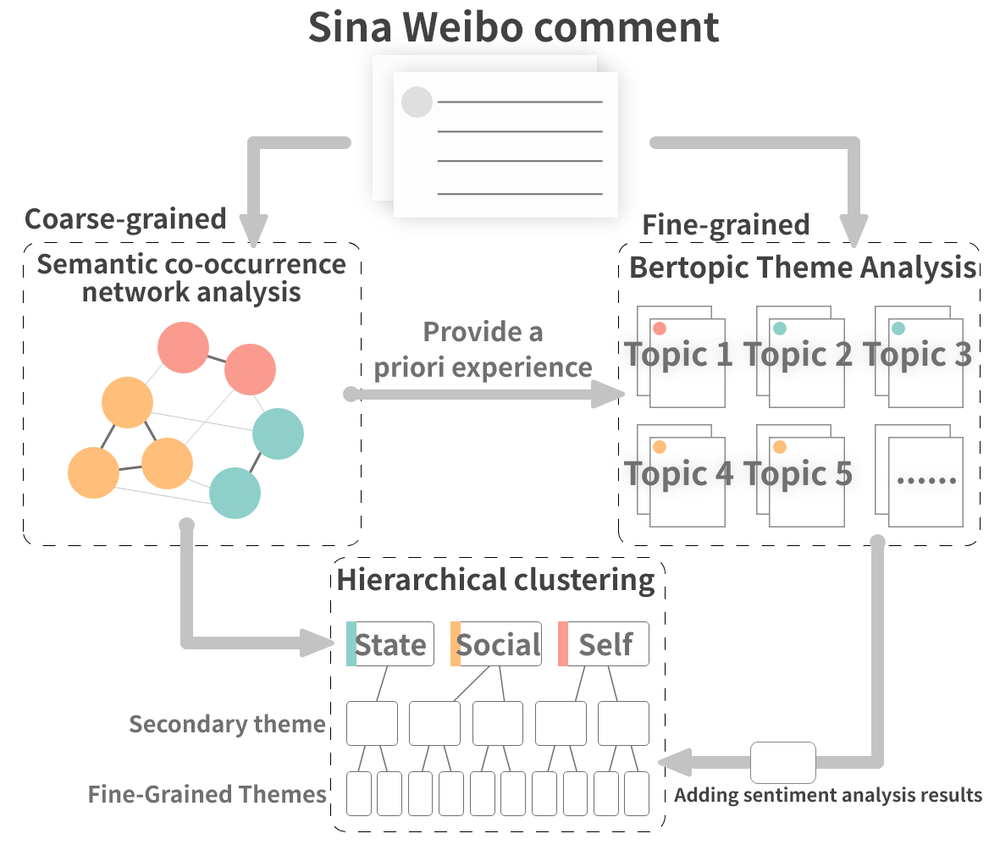

# An Empirical Study on Fertility Proposals Using Multi-Grained Topic Analysis Methods

**Author:** **Yulin, Zhou.**

**Abstract:**  Fertility issues are closely related to population security, in 60 years China's population for the first time in a negative growth trend, the change of fertility policy is of great concern to the community. 2023 "two sessions" proposal "suggests that the country in the form of legislation, the birth of the registration of the cancellation of the marriage restriction" This topic was once a hot topic on the Internet, and "unbundling" the relationship between birth registration and marriage has become the focus of social debate. In this paper, we adopt co-occurrence semantic analysis, topic analysis and sentiment analysis to conduct multi-granularity semantic analysis of microblog comments. It is found that the discussion on the proposal of "removing marriage restrictions from birth registration" involves the individual, society and the state at three dimensions, and is detailed into social issues such as personal behaviour, social ethics and law, and national policy, with people's sentiment inclined to be negative in most of the topics. Based on this, eight proposals were made to provide a reference for governmental decision making and to form a reference method for researching public opinion on political issues.

**Key words:** Online public opinion, Fertility policy, BERTopic, Sentiment analysis.

## Research Method
In this study, Sina Weibo was selected as the data collection platform, and the proposal to abolish marriage restrictions on birth registration was used as a representative policy issue for quantitative research. We captured the comments under the topic of "Suggesting the cancellation of marriage restrictions on birth registration", and obtained 12,509 comments after de-weighting and cleaning the data. Semantic co-occurrence network analysis is used to explore the domain of comment discussion, and the keyword results are fed into the Bertopic model as a priori experience. The resulting fine-grained topics are added to the sentiment analysis results and then hierarchically clustered to form the multi-granularity results.
#### [... Read full length paper](https://doi.org/10.48550/arXiv.2307.10025)

