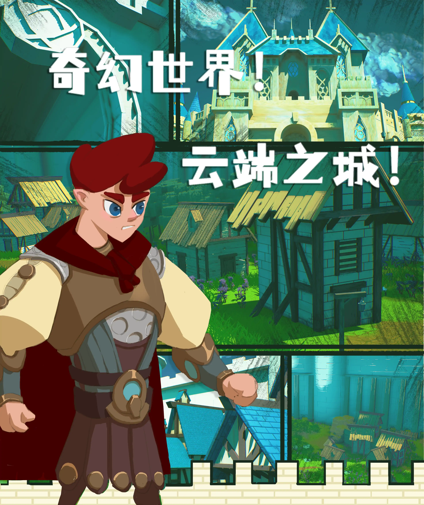
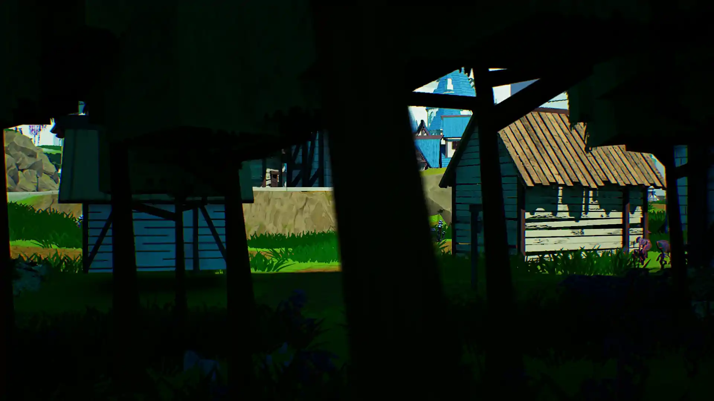
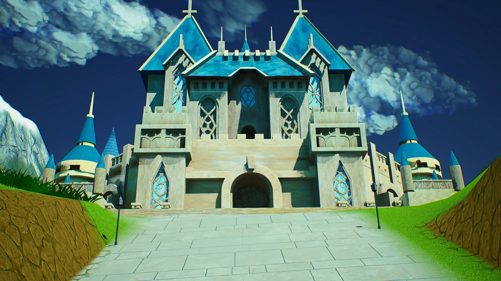
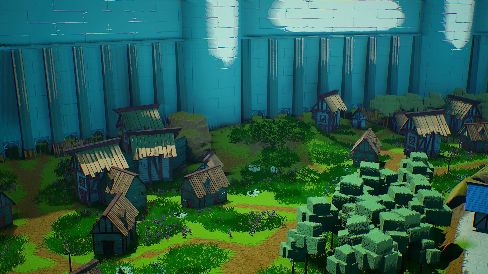
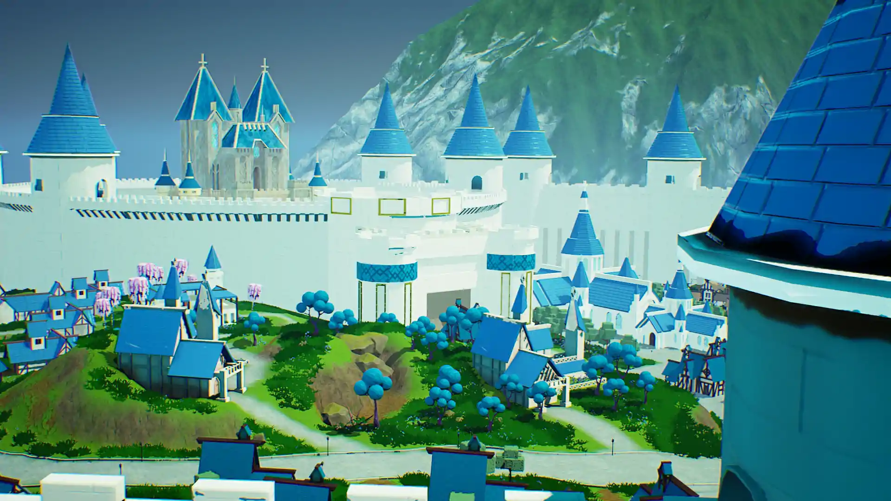
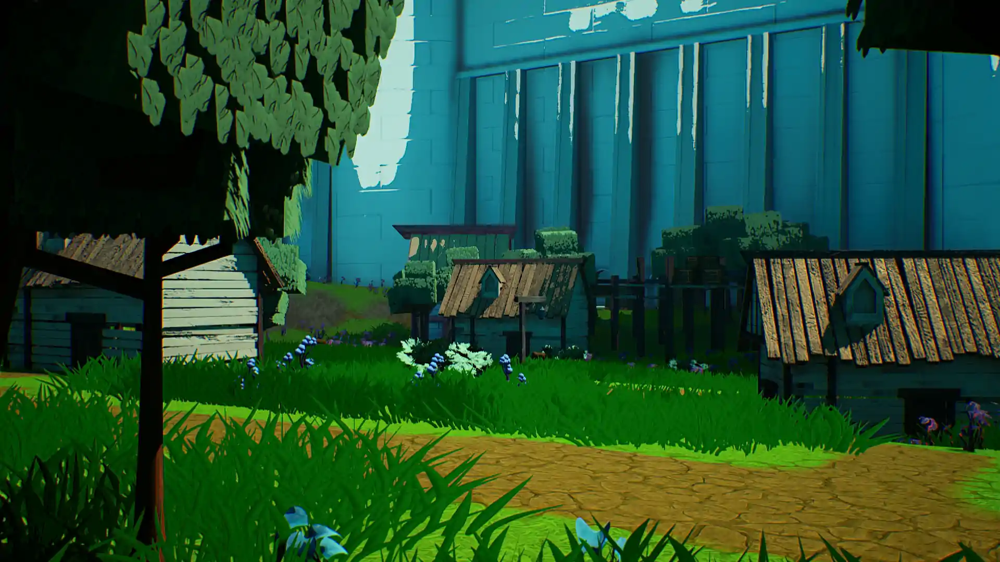
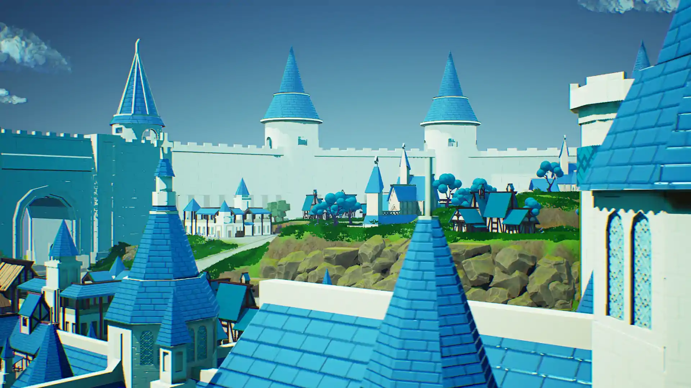

# Scene Roaming - The stylized city

## Introduction
This is a stylized city roaming project that floats above the sky, developed based on Unreal Engine 4. 
As a technical artist, my responsibilities encompass visual effects development, modeling, and workflow establishment. 

**Cartoon-style materials:** Modifying the post-processing effects in UE4 to achieve a rendering effect that closely resembles the cartoon style we want, while still maintaining the traditional PBR material production workflow.

**Model creation:** Emphasizing the use of the low-poly style as the primary aesthetic, and utilizing a blend of hand-drawn and PBR techniques. This approach minimizes the repetitive work for artists.

**Workflow control:** Implementing shared and reusable models, materials, and textures. Developing scripts for automatic material assignment and model material separation during the modeling phase, and automatically assembling materials onto models in UE4.

## Scene Photo

